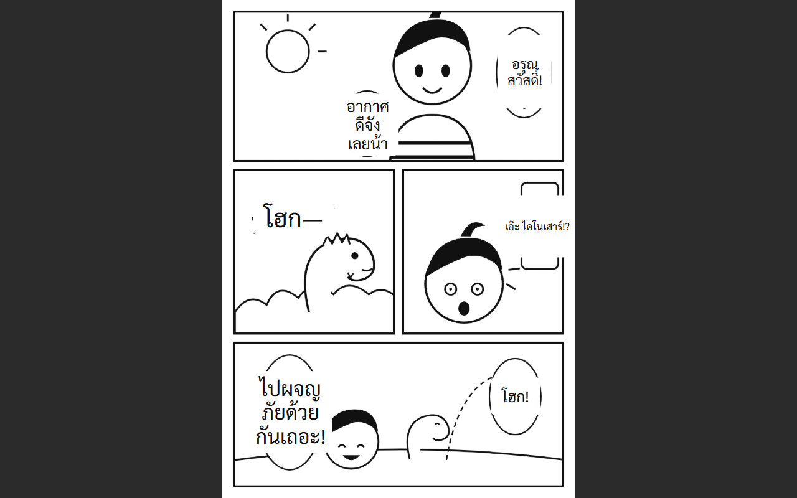
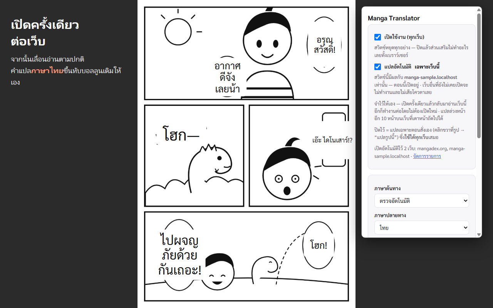

# Manga Translator 🦖

ส่วนเสริมเบราว์เซอร์ที่แปลมังงะญี่ปุ่นและอังกฤษเป็น**ภาษาไทยบนหน้าเว็บโดยตรง** วางคำแปลทับบอลลูนเดิม
ไม่ต้องแคปหน้าจอ ไม่ต้องครอปรูป ไม่ต้องกดแปลทีละหน้า — เปิดสวิตช์ครั้งเดียวต่อเว็บ แล้วเลื่อนอ่านตามปกติ



> ภาพนี้คือหน้าตัวอย่างที่วาดขึ้นสำหรับโปรเจกต์นี้ ([extension/store-assets/](extension/store-assets/)) ไม่ใช่มังงะของใคร

**รุ่นล่าสุด:** [v1.0.1 (เบต้า)](https://github.com/dinotong/Manga-Translator/releases/latest) · ใช้ได้กับ Chrome · Edge · Brave · ฟรีและโอเพนซอร์ส (Apache-2.0)

---

## ทำอะไรได้บ้าง

- **แปลอัตโนมัติขณะอ่าน** — เปิดแยกเป็นรายเว็บ เว็บที่ไม่ได้เปิดไว้ ส่วนเสริมจะไม่ทำอะไรเลยและไม่เสียโควตา
- **คลิกขวาที่รูป → "แปลรูปนี้"** — ใช้ได้กับทุกเว็บ โดยไม่ต้องเปิดแปลอัตโนมัติ
- **แปลหน้าถัดไปรอไว้** บนเว็บที่ URL หน้าถัดไปคาดเดาได้ พลิกหน้าแล้วคำแปลขึ้นทันที
- **ตรวจภาษาต้นฉบับเอง** จากตัวอักษรในรูป (ญี่ปุ่น / อังกฤษ)
- **ชี้เมาส์ที่กล่องคำแปล** ให้จางลงเพื่อดูภาพเดิมข้างหลัง กล่องคำแปลไม่ดูดคลิก เว็บที่คลิกรูปเพื่อเปลี่ยนหน้ายังใช้ได้ปกติ
- **ปรับได้** ขนาดตัวอักษร · ความทึบของแผ่นปิดต้นฉบับ · ความทึบของพื้นหลังคำแปล
- **แคชในเครื่อง** — หน้าที่เคยแปลแล้ว เปิดซ้ำขึ้นทันทีและไม่เสียโควตา
- **ใส่ API key ได้หลายอัน** — อันแรกโควตาหมดจะสลับไปอันถัดไปให้เอง

---

## ติดตั้ง

> ตอนนี้ยังเป็นรุ่นเบต้า ติดตั้งจากไฟล์ zip และ**ยังไม่อัปเดตตัวเอง** — กำลังเตรียมขึ้น Chrome Web Store

### 1. โหลดและแตกไฟล์

โหลด `manga-translator-extension-x.x.x-chrome.zip` จาก [หน้า Releases](https://github.com/dinotong/Manga-Translator/releases/latest)
แล้วแตกไว้ใน**โฟลเดอร์ถาวร** เช่น `D:\extensions\manga-translator`

> ⚠️ อย่าทิ้งไว้ใน Downloads แล้วลบทีหลัง เบราว์เซอร์อ่านจากโฟลเดอร์นี้ตลอด ลบเมื่อไหร่ส่วนเสริมหยุดทำงานทันที

### 2. ติดตั้งในเบราว์เซอร์

1. เปิด `chrome://extensions` *(Edge: `edge://extensions` · Brave: `brave://extensions`)*
2. เปิดสวิตช์ **Developer mode / โหมดนักพัฒนา**
3. กด **Load unpacked / โหลดส่วนขยายที่แตกไฟล์แล้ว**
4. เลือกโฟลเดอร์ที่แตกไว้ (โฟลเดอร์ที่มี `manifest.json` อยู่ข้างใน)

### 3. ใส่ Gemini API key ของตัวเอง (ฟรี ไม่ต้องผูกบัตร)

1. ขอ key ที่ [aistudio.google.com/apikey](https://aistudio.google.com/apikey) → **Create API key**
2. หน้าตั้งค่าของส่วนเสริมจะเปิดขึ้นมาเองหลังติดตั้ง (หรือคลิกขวาที่ไอคอน → **Options**)
3. วาง key ในหัวข้อ **Gemini API key** แล้วกด **ทดสอบ** เพื่อเช็คว่าใช้ได้

> ทุกคนต้องใช้ key ของตัวเอง เพราะโควตาผูกกับ key · key ฟรีหนึ่งอันแปลได้ราว 1,000 หน้าต่อวัน (ส่งทั้งหน้าในคำขอเดียว)

### 4. เปิดใช้กับเว็บที่อ่าน

เข้าเว็บมังงะ → คลิกไอคอนส่วนเสริม → เปิดสวิตช์ **แปลอัตโนมัติ เฉพาะเว็บนี้**
ส่วนเสริมจำไว้ให้ ครั้งหน้ากลับมาเว็บนี้ก็แปลต่อเอง



### อัปเดตเป็นรุ่นใหม่

โหลด zip รุ่นใหม่ → แตก**ทับโฟลเดอร์เดิม** → กดปุ่มรีโหลด (ลูกศรวน) ที่การ์ด Manga Translator ใน `chrome://extensions`
ตั้งค่า, key และแคชยังอยู่ครบ ไม่ต้องใส่ใหม่

---

## ใช้งาน

| อยากทำ | ทำยังไง |
|---|---|
| แปลทุกหน้าบนเว็บที่อ่านประจำ | ไอคอน → เปิด **แปลอัตโนมัติ เฉพาะเว็บนี้** |
| แปลแค่รูปเดียว / เว็บที่ไม่ได้เปิดไว้ | คลิกขวาที่รูป → **แปลรูปนี้ (Manga Translator)** |
| ดูภาพเดิมใต้คำแปล | ชี้เมาส์ที่กล่องคำแปล |
| ตัวอักษรเล็ก/ใหญ่ไป | ไอคอน → **ขนาดตัวอักษร** |
| อยากเห็นต้นฉบับจางๆ ใต้คำแปล | ไอคอน → ลด **แผ่นปิดต้นฉบับ** |
| หยุดทุกอย่างชั่วคราว | ไอคอน → ปิด **เปิดใช้งาน (ทุกเว็บ)** |
| จัดการรายการเว็บ / key / แคช | คลิกขวาที่ไอคอน → **Options** |

## เมื่อมีปัญหา

| อาการ | ลองทำ |
|---|---|
| ขึ้นว่า "ฝั่ง Gemini แน่นอยู่" | Google มีคนใช้เยอะในช่วงนั้น ไม่ใช่โควตาคุณหมด — รอสักครู่แล้วแปลใหม่ |
| ขึ้นว่าโควตาหมด | key ฟรีรีเซ็ตทุกวัน · เพิ่ม key สำรองในหน้า Options ได้ |
| ไม่แปลเลย | หน้า Options → **ตรวจสอบระบบ** กดปุ่มเดียว เช็คทุกส่วนพร้อมบอกวิธีแก้ |
| หา Developer mode ไม่เจอ / เปิดไม่ได้ | เครื่องที่ถูกองค์กรล็อกไว้จะเปิดไม่ได้ ลองเบราว์เซอร์อื่น หรือรอรุ่นใน Chrome Web Store |
| อย่างอื่น | เปิด [Issue](https://github.com/dinotong/Manga-Translator/issues) แล้วกด **คัดลอกผล Diagnostics** ในหน้า Options วางแนบมาด้วย (API key ในผลนั้นถูกปิดไว้ เหลือแค่ 4 ตัวท้าย) |

---

## ความเป็นส่วนตัว

- การหาตำแหน่งบอลลูนทำ**ในเครื่องของคุณ**
- ส่งออกไปแค่**ภาพส่วนที่มีตัวหนังสือ** ตรงไปที่ Google Gemini ด้วย key ของคุณเอง และเฉพาะตอนแปล
- ผู้พัฒนา**ไม่มีเซิร์ฟเวอร์**และไม่เก็บข้อมูลอะไรเลย
- key ตั้งค่า และแคช อยู่ในเครื่องคุณเท่านั้น (ไม่ซิงก์ข้ามเครื่อง)

ฉบับเต็ม: [docs/privacy.md](docs/privacy.md)

## ข้อจำกัดที่รู้อยู่

- **ยังไม่อัปเดตตัวเอง** จนกว่าจะขึ้น Chrome Web Store
- **ความเร็วขึ้นกับ Google** — ปกติ 3–50 วินาทีต่อคำขอ ช่วงคนใช้เยอะอาจช้ากว่านั้น ถ้าเกิน 90 วินาทีจะบอกให้ลองใหม่
- **คุณภาพคำแปลขึ้นกับ Gemini** — ยังไม่มีเครื่องมือวัดคุณภาพคำแปล เจอคำแปลแปลกๆ แจ้งใน Issues ได้
- **เว็บที่วาดรูปลง canvas** (เช่น Giga Viewer ของ Shonen Jump+) ยังไม่รองรับ
- รองรับเฉพาะเบราว์เซอร์ตระกูล Chromium · Safari / iOS ยังไม่ทำ ([เหตุผล](docs/05-safari-ios-research.md))

---

## สำหรับนักพัฒนา

### วิธีทำงาน

```
รูปในหน้าเว็บ
  → หาตำแหน่งข้อความ   PP-OCRv4 ในเบราว์เซอร์ (WebGPU ~120 ms/หน้า, ฟรี)
  → รวมเป็น bubble      union-find + จัดลำดับอ่าน
  → อ่าน + แปล          Gemini vision · ทั้งหน้าใน 1 request
  → วางคำแปลทับ         Shadow DOM overlay ผูกกับ hash ของรูป ไม่ใช่ element
  → cache               IndexedDB · ย้อนกลับไม่ทำงานซ้ำ
```

**ทำไมแยกเป็นสองส่วน:** การหาตำแหน่งทำในเครื่องได้เร็วและฟรี ส่วนการอ่านตัวอักษรญี่ปุ่นในเบราว์เซอร์วัดได้ **5.27 วินาทีต่อ bubble** ช้าเกินใช้จริง แต่ Gemini เป็น multimodal จึงอ่านและแปลรวดเดียวได้ — ตัวเลขที่วัดจริงอยู่ใน [ADR-001](docs/decisions/ADR-001-ocr-runtime.md)

### Build

```bash
cd extension && npm install && npm run check   # tsc + vitest
cd extension && npm run build                  # → extension/.output/chrome-mv3
cd extension && npm run zip                    # แพ็กเกจสำหรับแจก
```

เครื่องมือทดสอบบนเว็บ (`spike/`) — ลากรูปมังงะมาวาง ดูผลแปลพร้อมเวลาแต่ละขั้น: [spike/README.md](spike/README.md)

### เอกสาร

| ไฟล์ | เนื้อหา |
|---|---|
| [docs/00-technical-design.md](docs/00-technical-design.md) | สถาปัตยกรรม · ข้อมูลจริงของแต่ละเว็บ · ระบบพิกัด · cache |
| [docs/01-implementation-plan.md](docs/01-implementation-plan.md) | milestone M0–M7 |
| [docs/03-work-queue.md](docs/03-work-queue.md) | สถานะล่าสุด + คิวงาน |
| [docs/04-public-release-plan.md](docs/04-public-release-plan.md) | แผนเปิดให้คนทั่วไปใช้ |
| [docs/decisions/](docs/decisions/) | **ทุกการตัดสินใจพร้อมเหตุผล** และวิธีย้อนกลับ |
| [extension/CHANGELOG.md](extension/CHANGELOG.md) | สิ่งที่เปลี่ยนในแต่ละรุ่น |

### ขอบเขตที่ไม่ข้าม

- **ไม่ถอดรหัสมาตรการป้องกันของเว็บ** — เว็บที่สับ tile รูปเพื่อกันคัดลอก จะอ่านได้เฉพาะสิ่งที่แสดงบนจอแล้ว (หลักการเดียวกับ screen reader)
- **ไม่ยิงเซิร์ฟเวอร์รัว** — โหลดล่วงหน้าทีละคำขอ เว้นระยะ
- **ไม่ใช้ endpoint ภายในของบริการแปล** — เรียกเฉพาะ API ทางการ
- **ไม่ฝัง API key ของผู้พัฒนา** — ทุกคนใช้ key ของตัวเอง

## License

Apache-2.0 — [extension/LICENSE](extension/LICENSE) · ไลบรารีและโมเดลที่ใช้พร้อมใบอนุญาตของแต่ละตัว: [extension/NOTICE](extension/NOTICE)
